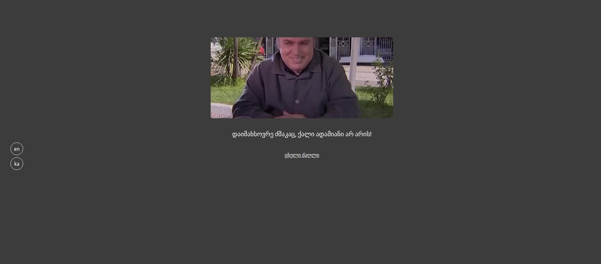

<h1 style="text-align:center;">Movie Quotes</h1>

Welcome to the Movie quotes web-aplication, it is a place where you can see posts about movies which contains relevat quotes with pictures.



## Table of Contents

* [Prerequisites](#req)
* [Packages](#packages)
* [Getting Started](#gettingStarted)
* [Resources](#resources)

#
<h2 id="req">Prerequisites:</h2>

<table>
    <tr>
        <td>* </td>
        <td>Laravel 8</td>
    </tr>
    <tr>
        <td>* </td>
        <td>PHP 8.0.11</td>
    </tr>
    <tr>
        <td>* </td>
        <td>Sqlite 3</td>
    </tr>
    <tr>
        <td>*</td>
        <td>npm 6.14.15</td>
    </tr>
    <tr>
        <td>* </td>
        <td>composer 2.1.9</td>
    </tr>
</table>

<h2 id="packages">packages:</h2>

<table>
    <tr>
        <td>* </td>
        <td>spatie/laravel-translatable</td>
    </tr>
</table>

<h2 id="gettingStarted">Getting Started</h2>

1\. First of all you need to clone Movie Quote repository from github:
```sh
git clone https://github.com/RedberryInternship/davitchanturia-movie-quotes.git
```

2\. Next step requires you to run *composer install* in order to install all the dependencies.
```sh
composer install
```

3\. Now we need to set our env file. Go to the root of your project and execute this command.
```sh
cp .env.example .env
```

And now you should provide **.env** file all the necessary environment variables. All you need here is DB_CONNECTION :
```sh
DB_CONNECTION=sqlite
```

4\. Now execute in the root of you project following:
```sh
  php artisan key:generate
```
Which generates auth key.

5\. Make MYSQL database user and connect to this projects, then you can execute the commands: 
```sh
  php artisan migrate
  php artisan db:seed
```

6\. You also need to make a storage link for the images with the command, mentioned below and change the FILESYSTEM_DRIVER to public in your .env file:
```sh
  php artisan storage:link
  FILESYSTEM_DRIVER=public
```

7\. in order to be able to use the admin panel you should register using artisan command 
```sh
  php artisan create:admin
```

8\. Then install translatable package
```sh
composer require spatie/laravel-translatable
```

